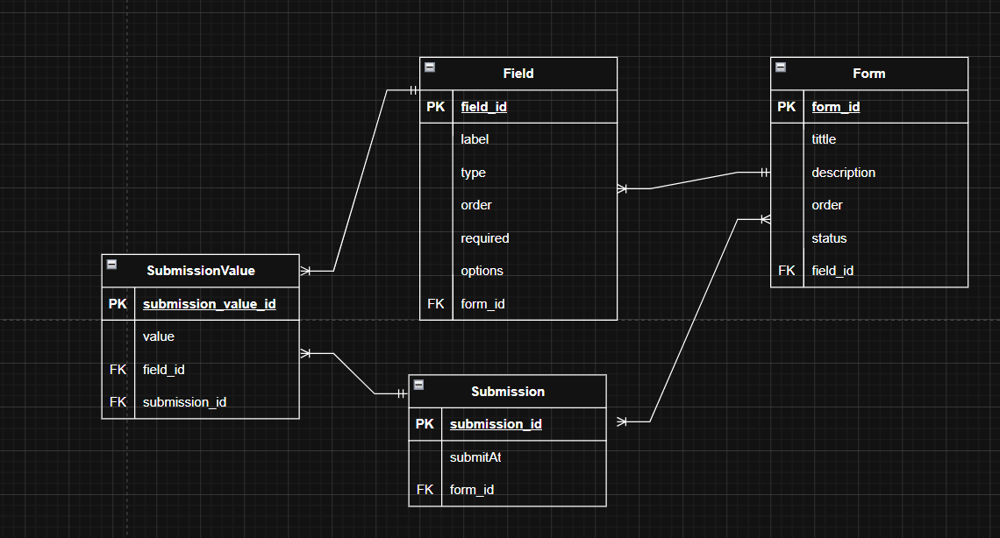

# 📋 Form Management API

Ứng dụng quản lý form xây dựng bằng **Spring Boot**, **MySQL**, hỗ trợ tạo form, quản lý field và thu thập submission.


Database schema được lưu trong src/main/resources/db/migration
---

## 🚀 Cài đặt & Chạy


1. Environment variables setup
```bash
SPRING_DATASOURCE_URL=jdbc:mysql://db:3306/formmanagement
SPRING_DATASOURCE_USERNAME=your_datasource_name
SPRING_DATASOURCE_PASSWORD=your_password
````

```bash
git clone https://github.com/What57-ph/Form_Management.git
docker compose up --build
```
```bash
Lưu ý: - Port Mysql có thể không đúng hoặc đang được sử dụng tùy máy, thay đổi theo máy cá nhân 
       - Khi không dùng docker, datasource url đổi từ "db" thành "localhost"
       - Datasource name và password khi chạy không dùng docker khác nhau tùy máy
```
Ứng dụng chạy tại: `http://localhost:8080`

---

## 📡 API Reference

**Base URL:** `http://localhost:8080/api/v1`

### Forms `/api/v1/forms`

| Method | Endpoint | Mô tả |
|--------|----------|-------|
| `GET` | `/forms` | Danh sách forms (phân trang) |
| `GET` | `/forms/active` | Danh sách forms active |
| `GET` | `/forms/{id}` | Chi tiết form |
| `POST` | `/forms` | Tạo form mới |
| `PATCH` | `/forms/{id}` | Cập nhật form |
| `DELETE` | `/forms/{id}` | Xoá form |
| `POST` | `/forms/{formId}/fields` | Thêm fields vào form |
| `PATCH` | `/forms/{formId}/fields/{fieldId}` | Cập nhật field trong form |
| `DELETE` | `/forms/{formId}/fields/{fieldId}` | Xoá field khỏi form |
| `POST` | `/forms/{id}/submit` | Nộp dữ liệu form |

<details>
<summary>Xem ví dụ request</summary>

**Tạo form:**
```json
POST /api/v1/forms
{
  "title": "Request for coming late 04/05/2026",
  "description": "Employee can request for coming late",
  "order": 4
}
```

**Thêm fields:**
```json
POST /api/v1/forms/1/fields
[
  { "label": "Name", "type": "TEXT", "order": 1, "required": true, "options": [] },
  { "label": "Employee ID", "type": "TEXT", "order": 2, "required": true, "options": [] },
  { "label": "Reason", "type": "SELECT", "order": 3, "required": true, "options": ["8h30AM - 9h30AM Sat", "9h30AM - 11h30AM Sat"] }
]
```

**Submit form:**
```json
POST /api/v1/forms/1/submit
{
  "fieldValueList": [
    { "fieldId": 4, "fieldType": "TEXT", "value": "ABC" },
    { "fieldId": 5, "fieldType": "TEXT", "value": "220192138" },
    { "fieldId": 6, "fieldType": "SELECT", "value": "8h30AM - 9h30AM Sat" }
  ]
}
```
</details>

---

### Fields `/api/v1/fields`

| Method | Endpoint | Mô tả |
|--------|----------|-------|
| `GET` | `/fields` | Danh sách fields (phân trang) |
| `GET` | `/fields/{id}` | Chi tiết field |
| `POST` | `/fields` | Tạo field mới |
| `PATCH` | `/fields/{id}` | Cập nhật field |
| `DELETE` | `/fields/{id}` | Xoá field |

---

### Submissions `/api/v1/submissions`

| Method | Endpoint | Mô tả |
|--------|----------|-------|
| `GET` | `/submissions` | Danh sách submissions (phân trang) |

> **Query params chung:** `pageNumber` (mặc định `0`), `pageSize` (mặc định `5`)
